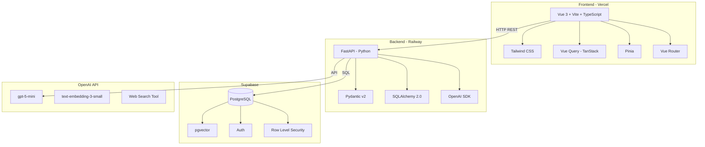
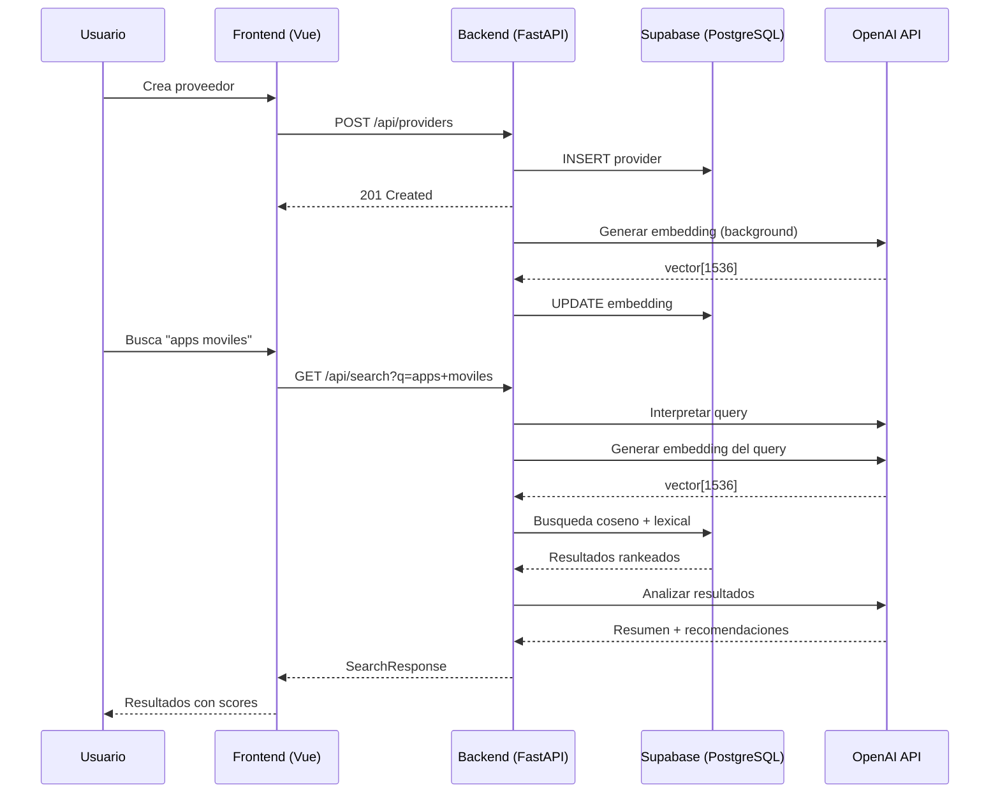
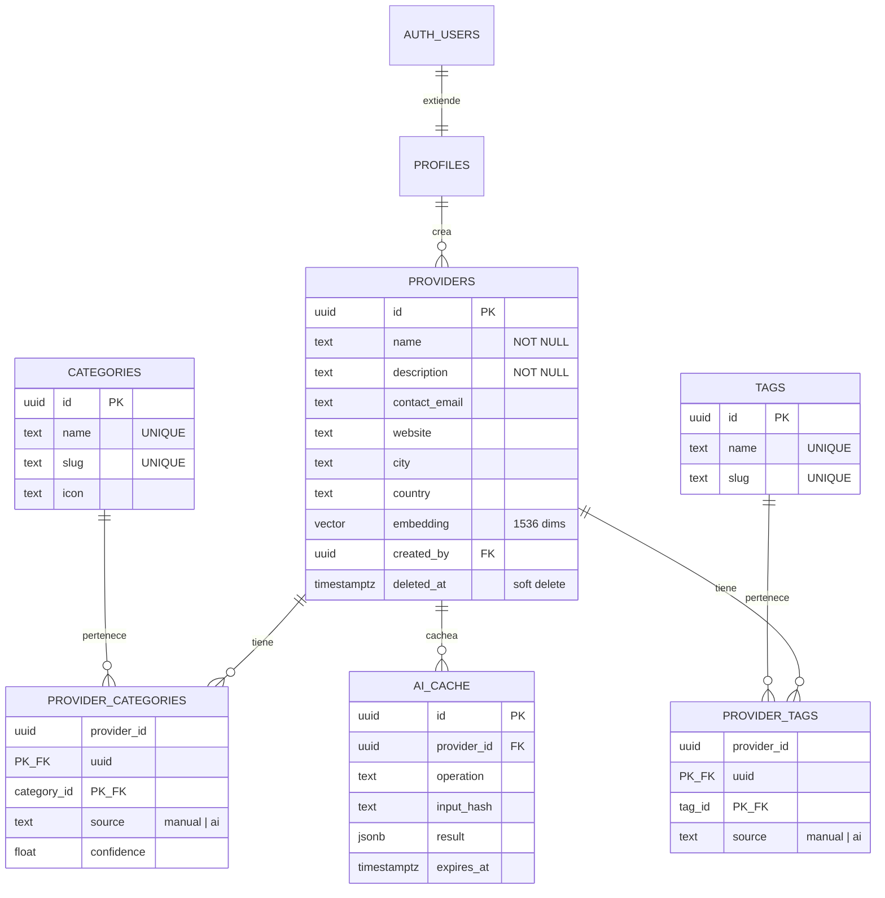
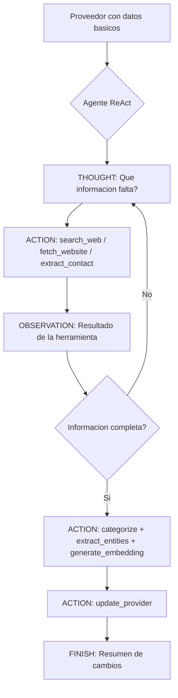
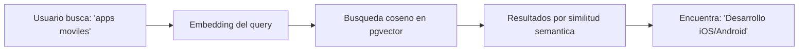
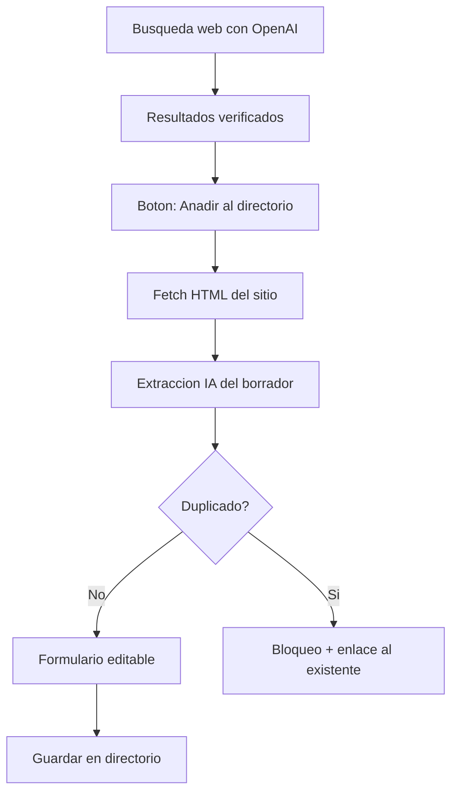

# BC Directorio Inteligente


Plataforma full-stack para gestionar un directorio de proveedores de servicios tecnologicos con **busqueda semantica por IA**, categorizacion automatica e importacion inteligente desde la web.

**[Demo en vivo](https://nexo-dun.vercel.app)** | **[API Docs (Swagger)](https://bc-directorio-backend-production.up.railway.app/api/docs)**

---

## Tabla de Contenidos

- [Caso de uso](#caso-de-uso)
- [Arquitectura](#arquitectura)
- [Stack tecnologico](#stack-tecnologico)
- [Modelo de datos](#modelo-de-datos)
- [Integraciones con IA](#integraciones-con-ia)
- [Estructura del proyecto](#estructura-del-proyecto)
- [Instalacion local](#instalacion-local)
- [Deploy](#deploy)
- [Documentacion adicional](#documentacion-adicional)

---

## Caso de uso

**Caso C — Directorio de Proveedores Inteligente (CRUD)** de la prueba tecnica BC.

Una plataforma para gestionar proveedores de servicios (Crear, Leer, Actualizar, Eliminar) con un buscador inteligente y categorizacion automatica por IA basada en la descripcion del proveedor.

---

## Arquitectura



### Flujo de datos



---

## Stack tecnologico

| Capa | Tecnologia | Justificacion |
|------|-----------|---------------|
| **Frontend** | Vue 3.5 + Vite 8 + TypeScript | Composition API, Vite 8 con builds rapidos |
| **UI** | Tailwind CSS 4.2 | Componentes custom, responsive, dark mode |
| **Estado** | Pinia + Vue Query (TanStack) | Pinia para estado local, Vue Query para cache del servidor |
| **Backend** | FastAPI (Python) | Async nativo, Swagger automatico |
| **Validacion** | Pydantic v2 | Schemas de request/response con validacion automatica |
| **Base de datos** | Supabase (PostgreSQL + pgvector) | Auth integrada, RLS, busqueda vectorial |
| **ORM** | SQLAlchemy 2.0 | Estandar Python, async con asyncpg |
| **IA** | OpenAI API | gpt-5-mini (categorizacion), text-embedding-3-small (embeddings) |
| **Deploy Frontend** | Vercel | Deploy automatico, free tier |
| **Deploy Backend** | Railway | Contenedor Python, free tier |

---

## Modelo de datos



### Decisiones de arquitectura

| Decision | Eleccion | Razon |
|----------|----------|-------|
| IDs | UUID v4 | No predecibles, seguros para URLs |
| Timestamps | TIMESTAMPTZ | Evita bugs de zona horaria |
| Eliminacion | Soft delete | Auditoria y recuperacion |
| Relaciones N:N | Tablas intermedias | Normalizado, permite metadatos (source, confidence) |
| Embeddings | Columna en providers | Un embedding por proveedor |
| Cache IA | Tabla ai_cache | Menos infra que Redis, suficiente para MVP |
| Indice vectorial | IVFFlat | Menor memoria, suficiente para <10K registros |
| RLS | Todas las tablas | Requisito de seguridad con Supabase |

> Documentacion detallada del modelo: [docs/modelo-datos.md](docs/modelo-datos.md)

---

## Integraciones con IA

El proyecto integra **4 servicios de IA** con OpenAI:

### 1. Agente de enriquecimiento autonomo (ReAct)



Un agente con patron **ReAct** (Reason + Act) que enriquece proveedores de forma autonoma:
- Analiza que informacion falta del proveedor
- Decide que herramientas usar en cada paso (busqueda web, scraping, extraccion de contacto, categorizacion, embeddings)
- Itera con un loop de razonamiento hasta completar el perfil o agotar el limite de iteraciones
- Reporta cada decision con trazabilidad paso a paso (thought → action → observation)

**Herramientas del agente:**
- `search_web` — Busca informacion del proveedor en internet
- `fetch_website` — Parsea contenido de un sitio web
- `extract_contact` — Extrae emails y telefonos de contenido web
- `categorize` — Categoriza al proveedor usando IA
- `extract_entities` — Extrae servicios, tecnologias y especialidades
- `generate_embedding` — Genera embedding vectorial
- `update_provider` — Aplica los datos descubiertos al registro

### 2. Categorizacion automatica

Al crear un proveedor, gpt-5-mini analiza la descripcion y sugiere categorias del catalogo + tags relevantes.

### 3. Busqueda semantica con embeddings



- Al guardar un proveedor se genera un embedding con `text-embedding-3-small`
- Se almacena en columna `VECTOR(1536)` via pgvector
- La busqueda convierte el query a embedding y busca por similitud coseno
- El resultado: buscar "alguien que haga apps" encuentra proveedores de "desarrollo movil iOS/Android"

### 4. Importacion inteligente desde la web



- El usuario ejecuta una busqueda web desde la plataforma
- Puede importar un resultado como proveedor con un clic
- La IA extrae nombre, descripcion, contacto, categorias y tags del sitio web
- El usuario revisa y confirma antes de guardar

---

## Estructura del proyecto

```
bc-directorio/
├── frontend/                      # Vue 3 + Vite + TypeScript
│   ├── src/
│   │   ├── components/            # Componentes reutilizables
│   │   │   ├── ui/                # Componentes base (Button, Card, Input, etc.)
│   │   │   ├── providers/         # Formulario compartido de proveedores
│   │   │   └── search/            # Resultados de busqueda, modal de importacion
│   │   ├── views/                 # Paginas (Home, Login, Search, ProviderDetail, ProviderForm)
│   │   ├── composables/           # Logica reutilizable (useAuth, useProviders, useSearch, useCsv)
│   │   ├── lib/                   # Clientes (api.ts, supabase.ts)
│   │   ├── types/                 # Tipos TypeScript
│   │   └── router/                # Rutas con guards de autenticacion
│   ├── package.json
│   └── vite.config.ts
│
├── backend/                       # FastAPI (Python)
│   ├── app/
│   │   ├── api/                   # Endpoints: providers, categories, search, ai, agents
│   │   ├── models/                # SQLAlchemy models
│   │   ├── schemas/               # Pydantic schemas (request/response)
│   │   ├── services/              # Logica de negocio: IA, agente ReAct, busqueda, importacion web
│   │   ├── core/                  # Config, database, dependencias, auth
│   │   └── main.py                # Entry point FastAPI
│   ├── alembic/                   # Migraciones de base de datos
│   └── requirements.txt
│
├── docs/                          # Documentacion del proyecto
│   ├── modelo-datos.md            # Modelo de datos detallado con diagramas
│   ├── instalacion-local.md       # Guia de instalacion paso a paso
│   ├── manual-usuario.md          # Manual para usuarios finales
│   └── api.md                     # Documentacion de endpoints REST
│
└── plans/                         # Documentos de planificacion interna
    ├── plan_de_trabajo.md
    ├── database_schema.md
    └── plan_busqueda_ia_avanzada.md
```

---

## Instalacion local

### Prerrequisitos

- Python 3.12+
- Node.js 20.19+ o 22.12+
- pnpm 9+
- Cuenta Supabase (free tier)
- API Key de OpenAI

### Inicio rapido

```bash
# Clonar
git clone https://github.com/MrPepePollo/BC-Directorio-Inteligente.git
cd BC-Directorio-Inteligente

# Backend
cd backend
python3 -m venv .venv
source .venv/bin/activate
pip install -r requirements.txt
cp .env.example .env  # Configurar variables
uvicorn app.main:app --reload --port 8000

# Frontend (en otra terminal)
cd frontend
pnpm install
cp .env.example .env  # Configurar variables
pnpm dev
```

> Guia completa con variables de entorno, setup de Supabase y troubleshooting: [docs/instalacion-local.md](docs/instalacion-local.md)

---

## Deploy

| Servicio | Plataforma | URL |
|----------|-----------|-----|
| Frontend | Vercel | [nexo-dun.vercel.app](https://nexo-dun.vercel.app) |
| Backend | Railway | [bc-directorio-backend-production.up.railway.app](https://bc-directorio-backend-production.up.railway.app/api/docs) |
| Base de datos | Supabase | PostgreSQL + pgvector |

---

## Documentacion adicional

| Documento | Descripcion |
|-----------|-------------|
| [Modelo de Datos](docs/modelo-datos.md) | Diagrama ER, detalle de tablas, indices, RLS, decisiones de arquitectura |
| [Instalacion Local](docs/instalacion-local.md) | Guia paso a paso para levantar el proyecto desde cero |
| [Manual de Usuario](docs/manual-usuario.md) | Guia para usuarios finales: como usar la aplicacion |
| [Documentacion API](docs/api.md) | Endpoints REST con ejemplos de request/response |
| [Swagger UI](https://bc-directorio-backend-production.up.railway.app/api/docs) | Documentacion interactiva auto-generada por FastAPI |

---

## Uso de IA en el desarrollo

Este proyecto fue desarrollado utilizando **Claude Code** (Anthropic) y **Codex** (OpenAI) como herramientas de aceleracion de desarrollo, asistiendo en:

- Planificacion de arquitectura y modelo de datos
- Implementacion de endpoints y logica de negocio
- Integracion con OpenAI API
- Configuracion de deploy (Railway, Vercel)
- Generacion de documentacion

La IA dentro de la aplicacion se usa para:
1. **Agente autonomo de enriquecimiento** con patron ReAct — razona, decide que herramientas usar, y enriquece proveedores iterativamente (gpt-5-mini + tool-use)
2. **Categorizacion automatica** de proveedores (gpt-5-mini)
3. **Busqueda semantica** con embeddings vectoriales (text-embedding-3-small + pgvector)
4. **Extraccion de entidades** de descripciones de proveedores (gpt-5-mini)
5. **Busqueda web** de proveedores externos (OpenAI Responses API con web_search)
6. **Importacion inteligente** desde sitios web a proveedores del directorio (gpt-5-mini)
