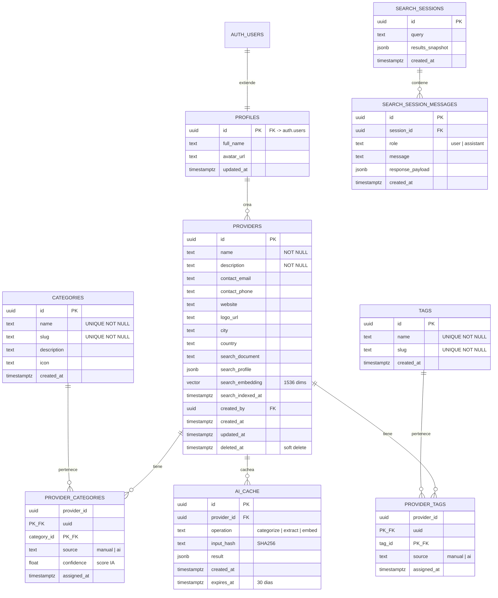
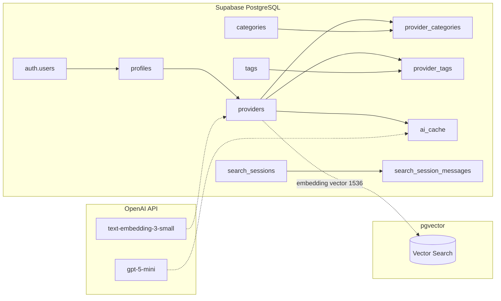

# Modelo de Datos — BC Directorio Inteligente

## Tabla de Contenidos

- [Diagrama Entidad-Relacion](#diagrama-entidad-relacion)
- [Diagrama de Arquitectura de Datos](#diagrama-de-arquitectura-de-datos)
- [Detalle de Tablas](#detalle-de-tablas)
- [Funciones SQL](#funciones-sql)
- [Decisiones de Arquitectura](#decisiones-de-arquitectura)

---

## Diagrama Entidad-Relacion



---

## Diagrama de Arquitectura de Datos



---

## Detalle de Tablas

### Tabla: `profiles`

Extiende la tabla `auth.users` de Supabase con datos de perfil adicionales.

| Columna | Tipo | Nullable | Default | Descripcion |
|---------|------|----------|---------|-------------|
| id | uuid | NO | - | PK, FK hacia auth.users |
| full_name | text | SI | NULL | Nombre completo del usuario |
| avatar_url | text | SI | NULL | URL del avatar |
| updated_at | timestamptz | NO | now() | Ultima actualizacion |

**Trigger:** `on_auth_user_created` — crea automaticamente un perfil al registrarse un usuario nuevo.

**RLS:**
- `profiles_select_own`: solo el usuario puede ver su perfil
- `profiles_update_own`: solo el usuario puede editar su perfil

---

### Tabla: `providers`

Tabla principal del directorio. Almacena la informacion de cada proveedor de servicios.

| Columna | Tipo | Nullable | Default | Descripcion |
|---------|------|----------|---------|-------------|
| id | uuid | NO | gen_random_uuid() | Identificador unico |
| name | text | NO | - | Nombre del proveedor |
| description | text | NO | - | Descripcion de servicios |
| contact_email | text | SI | NULL | Email de contacto |
| contact_phone | text | SI | NULL | Telefono de contacto |
| website | text | SI | NULL | Sitio web |
| logo_url | text | SI | NULL | URL del logo |
| city | text | SI | NULL | Ciudad |
| country | text | SI | NULL | Pais |
| search_document | text | SI | NULL | Documento de texto consolidado para busqueda |
| search_profile | jsonb | SI | {} | Perfil estructurado para ranking |
| search_embedding | vector(1536) | SI | NULL | Embedding vectorial para busqueda semantica |
| search_indexed_at | timestamptz | SI | NULL | Timestamp del ultimo indexado |
| created_by | uuid | SI | NULL | FK hacia auth.users |
| created_at | timestamptz | NO | now() | Fecha de creacion |
| updated_at | timestamptz | NO | now() | Ultima actualizacion (auto via trigger) |
| deleted_at | timestamptz | SI | NULL | Soft delete |

**Constraints:**
- `providers_name_not_empty`: name debe tener al menos 1 caracter
- `providers_desc_not_empty`: description debe tener al menos 1 caracter
- `providers_email_format`: validacion regex del email

**Indices:**
- `idx_providers_created_by` — busqueda por creador
- `idx_providers_deleted_at` — filtro parcial para registros activos
- `idx_providers_created_at` — ordenamiento por fecha DESC
- `idx_providers_name_trgm` — busqueda parcial por nombre (trigram GIN)
- `idx_providers_embedding` — busqueda vectorial IVFFlat (coseno)

**RLS:**
- `providers_select_active`: cualquiera puede leer proveedores activos (deleted_at IS NULL)
- `providers_insert_auth`: solo usuarios autenticados pueden crear
- `providers_update_owner`: solo el creador puede editar
- `providers_delete_owner`: solo el creador puede eliminar (soft delete)

---

### Tabla: `categories`

Catalogo de categorias de servicio. Incluye 10 categorias predefinidas.

| Columna | Tipo | Nullable | Default | Descripcion |
|---------|------|----------|---------|-------------|
| id | uuid | NO | gen_random_uuid() | Identificador unico |
| name | text | NO | - | Nombre de la categoria (UNIQUE) |
| slug | text | NO | - | Slug URL-friendly (UNIQUE) |
| description | text | SI | NULL | Descripcion de la categoria |
| icon | text | SI | NULL | Nombre del icono (Lucide) |
| created_at | timestamptz | NO | now() | Fecha de creacion |

**Categorias predefinidas:** Desarrollo Web, Desarrollo Movil, Diseno UI/UX, Data Science, Cloud & DevOps, Ciberseguridad, Marketing Digital, Consultoria IT, ERP & CRM, Soporte & Mantenimiento.

---

### Tabla: `provider_categories`

Relacion N:N entre proveedores y categorias. Permite metadatos como la fuente de la asignacion.

| Columna | Tipo | Nullable | Default | Descripcion |
|---------|------|----------|---------|-------------|
| provider_id | uuid | NO | - | PK compuesta, FK hacia providers |
| category_id | uuid | NO | - | PK compuesta, FK hacia categories |
| source | text | NO | 'manual' | Origen: 'manual' o 'ai' |
| confidence | real | SI | NULL | Score de confianza de la IA (0-1) |
| assigned_at | timestamptz | NO | now() | Fecha de asignacion |

---

### Tabla: `tags`

Etiquetas generadas por IA o creadas manualmente.

| Columna | Tipo | Nullable | Default | Descripcion |
|---------|------|----------|---------|-------------|
| id | uuid | NO | gen_random_uuid() | Identificador unico |
| name | text | NO | - | Nombre del tag (UNIQUE) |
| slug | text | NO | - | Slug URL-friendly (UNIQUE) |
| created_at | timestamptz | NO | now() | Fecha de creacion |

---

### Tabla: `provider_tags`

Relacion N:N entre proveedores y tags.

| Columna | Tipo | Nullable | Default | Descripcion |
|---------|------|----------|---------|-------------|
| provider_id | uuid | NO | - | PK compuesta, FK hacia providers |
| tag_id | uuid | NO | - | PK compuesta, FK hacia tags |
| source | text | NO | 'manual' | Origen: 'manual' o 'ai' |
| assigned_at | timestamptz | NO | now() | Fecha de asignacion |

---

### Tabla: `ai_cache`

Cache de respuestas de la API de OpenAI para evitar llamadas duplicadas.

| Columna | Tipo | Nullable | Default | Descripcion |
|---------|------|----------|---------|-------------|
| id | uuid | NO | gen_random_uuid() | Identificador unico |
| provider_id | uuid | NO | - | FK hacia providers |
| operation | text | NO | - | Tipo: 'categorize', 'extract', 'embed' |
| input_hash | text | NO | - | SHA256 del input para deduplicacion |
| result | jsonb | NO | - | Resultado cacheado de la IA |
| created_at | timestamptz | NO | now() | Fecha de creacion |
| expires_at | timestamptz | NO | now() + 30 dias | Expiracion del cache |

**Constraint:** `ai_cache_unique_op` — UNIQUE(provider_id, operation, input_hash)

**RLS:** `ai_cache_no_public` — solo accesible via service_role key (backend)

---

### Tabla: `search_sessions`

Sesiones de busqueda para persistir contexto de interacciones con el analista IA.

| Columna | Tipo | Nullable | Default | Descripcion |
|---------|------|----------|---------|-------------|
| id | uuid | NO | gen_random_uuid() | Identificador unico |
| query | text | NO | - | Query original del usuario |
| results_snapshot | jsonb | SI | NULL | Snapshot de resultados para grounding |
| created_at | timestamptz | NO | now() | Fecha de creacion |

---

### Tabla: `search_session_messages`

Mensajes dentro de una sesion de busqueda (historial de conversacion con el analista).

| Columna | Tipo | Nullable | Default | Descripcion |
|---------|------|----------|---------|-------------|
| id | uuid | NO | gen_random_uuid() | Identificador unico |
| session_id | uuid | NO | - | FK hacia search_sessions |
| role | text | NO | - | 'user' o 'assistant' |
| message | text | NO | - | Contenido del mensaje |
| response_payload | jsonb | NO | - | Payload completo de la respuesta |
| created_at | timestamptz | NO | now() | Fecha de creacion |

---

## Funciones SQL

### `search_providers_semantic()`

Busqueda por similitud coseno sobre los embeddings vectoriales.

```sql
search_providers_semantic(
  query_embedding VECTOR(1536),
  match_threshold FLOAT DEFAULT 0.7,
  match_count INT DEFAULT 20
) RETURNS TABLE (id, name, description, city, country, similarity)
```

### `get_directory_stats()`

Estadisticas del directorio: total de proveedores, categorias, tags, distribucion por categoria y por pais.

---

## Decisiones de Arquitectura

| Decision | Eleccion | Alternativa descartada | Razon |
|----------|----------|------------------------|-------|
| IDs | UUID v4 | SERIAL / autoincrement | No predecibles, seguros para exponer en URLs |
| Timestamps | TIMESTAMPTZ | TIMESTAMP | Evita bugs de zona horaria en produccion |
| Eliminacion | Soft delete (deleted_at) | Hard delete | Permite auditoria y recuperacion |
| Categorias <-> Providers | Tabla intermedia N:N | Array de UUIDs | Normalizado, indexable, permite metadatos (source, confidence) |
| Tags <-> Providers | Tabla intermedia N:N | JSONB array | Misma razon que categorias |
| Embeddings | Columna vector en providers | Tabla separada | Un embedding por proveedor, no justifica tabla aparte |
| Cache de IA | Tabla ai_cache | Redis | Menos infraestructura, suficiente para el volumen del MVP |
| Busqueda por texto | pg_trgm (trigram) | Full-text search | Mas simple para busqueda parcial por nombre |
| Indice vectorial | IVFFlat | HNSW | Menor uso de memoria, suficiente para <10K registros |
| RLS | Habilitado en todas las tablas | Sin RLS | Seguridad a nivel de fila es requisito con Supabase |
